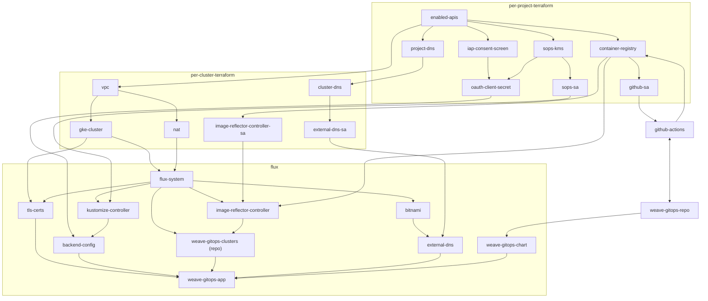

# GKE cluster set up

**WARNING**
This is almost certainly incomplete, wrong and likely misleading. But it's
(probably) better than nothing so it's impossible to say whether it's bad or not.

## Intro

This attempts to explain what the [gke-cluster](../gke-cluster) project creates and how
things inter-relate. It is split into two:

* [the bits](#the-bits) which covers what's configured where and (sometimes) why
  - Also comes in [diagram](#diagram) flavour, you've been warned!
* [the pain](#the-pain) which covers things that I struggled with setting up

## The bits

* Terraform
  - Per Project (setup/configure-gcp-project)
    + Enabled APIS
    + DNS hosted zone (wego-gke.weave.works)
    + Container Registry
    + Github service account
      * Can write to the container registry
      * Uses workload identity to side-step secrets requirements
    + IAP consent screen (AKA iap_brand)
    + Sops KMS key
    + Sops decrypter service account
  - Per cluster
    + DNS hosted zone (e.g. euw1.wego-gke.weave.works)
    + external-dns service account
      * has project level DNS admin (e.g. can write wego-gke.weave.works)
        - This (should) be tightened
    + Image reflector controller service account
      * Has read permissions on the artifact registry (to get tags)
    + VPC + subnets
      * Single zone
      * 3 blocks of defined IPs
        - main (used for VMs etc)
        - pod
        - service
    + NAT
      * Needed if the cluster is going to actually work with public resources
    + GKE cluster
      * configured to be private (no public IPs)
      * separate node pool
* Flux
  - secrets
    + oauth-client credentials
      * Needed to configure the backend config with IAP
      * Encrypted via sops using google KMS
  - flux-system
    + kustomize-controller service account
      * annotated with sops decrypter (google) service account id
    + image-reflector-controller service account
      * annotated with image reflector controller (google) service account id
  - infrastructure
    + [backend config](https://cloud.google.com/kubernetes-engine/docs/how-to/ingress-features#iap)
      * Used to configure IAP on the ingress
      * CRD managed by google as part of a default GKE cluster
    + flux sources:
      * bitnami (helm)
      * weave-gitops (git)
    + external-dns
      * installed from bitnami
      * uses the external-dns service account
      * generates DNS records based on ingress host attributes
        - e.g. gitops.euw1.wego-gke.weave.works (cf. weave-gitops-app ingress)
  - apps
    + weave-gitops-app
      * tls-certs
        - uses google ManagedCertificate CRD
        - Provides TLS _to_ the load balancer (i.e. traffic from the LB to the pod is currently unencrypted)
      * main helmRelease
        - Has to annotate the _service_ to indicate which backend needs to be used
        - Ingress is annotated to set the _ingresses_ tls certs & host
        - Currently running with `--insecure` (as http from LB)
      * image-auto-update
        - main branch protection disabled on this repo to allow updates to main
        - requires flux has been bootstrapped with addons & read-write key

### Diagram

## The pain

### IAP

This was probably the major pain point
* Requires correct configuration of consent page & oauth client
* Secrets need to be available in cluster
* IAP is configured on the backend resource
* Backend resource is set on the service
* Ingress is configured separately (but required)
* TLS &/or DNS are (apparently) required
* TLS & DNS are configured on the ingress

### DNS
DNS had some red-herrings
* GKE has 'dns_config'. This is a replacement for kubedns and has nothing to do
  with external DNS
* external-dns' helm chart is managed by a third party (bitnami) so both the
  [gke tutorial](https://github.com/kubernetes-sigs/external-dns/blob/master/docs/tutorials/gke.md#gke-with-workload-identity)
  for external-dns and the [chart docs](https://github.com/bitnami/charts/tree/master/bitnami/external-dns)
  need to be checked
* The plan for this is to ultimately end up with wego-gke.weave.works and
  wego-eks.weave.works The reason for this split (instead of gke.wego & eks.wego)
  is because it avoids running multiple providers to configure DNS

### Service accounts

Google/kubernetes service accounts via [Workload Identity](https://cloud.google.com/kubernetes-engine/docs/how-to/workload-identity)
* The service account receives a _project_ IAM membership
  (`google_project_iam_member` in terraform), this grants the SA google permissions
* The workload ID (`serviceAccount:${project}.svc.id.goog[${k8s-namespace}/${k8s-service-account-name}`)
  is then granted `roles/iam.workloadIdentityUser` on the service account
  (`google_service_account_iam_member` in terraform)
